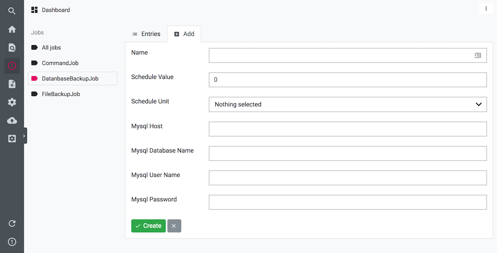

# Backup Module

Based on [LUYA schedule module](https://github.com/boehsermoe/luya-module-scheduler)


## Installation

`composer require boehsermoe/luya-module-backup`

In order to add the modules to your project go into the modules section of your config:

```php
return [
    'modules' => [
        // ...
        'backup' => [
            'class' => 'luya\backup\Module',
            
            // Path where files will exported. default @runtime/backups
            //'exportDir' => '/your/export/path' 
        ],
        // ...
    ],
];
```

## Create a new job

Scheduler -> DatabaseBackupJobs -> Add




## Execute job

```
./luya scheduler/run/now {job id/name}
```
